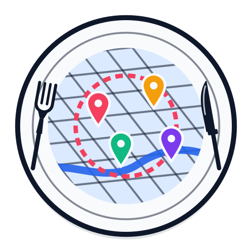

<p align="center">
  <a href="https://my-food-list.vercel.app/">
    
  </a>
</p>

<p align="center">
  <em>A personal, curated map of where to eat and drink in Belo Horizonte — rate the places you've been, keep private notes, and plan the shortest walking route for your next bar crawl.</em>
</p>

<p align="center">
  <strong>Live at <a href="https://my-food-list.vercel.app/">my-food-list.vercel.app</a></strong>
</p>

<p align="center">
  
  
  
  
  
  
  
  
  
</p>

---

## 📖 About

**My Food List** is a web **food map** (in pt-BR) of Belo Horizonte, MG. It started as a personal list of favorite bars and restaurants and grew into a small product: **56 hand-picked places** pinned on an interactive map, each with a facade photo, opening hours, menu, Instagram post, and its position in the **Exame Casual "100 Melhores Restaurantes do Brasil"** ranking when it has one.

Signed in, you can **rate** each place (1–5 stars), write a **private note** on a taped paper pad, and filter the map down to your **favorites**. The **Rolê de bares** page lets you pick a handful of places and get the **shortest walking route** through all of them — or your own order — with a shareable short link.

Two deliberate design decisions shape the codebase:

- **No backend for the catalog.** Every place is a JSON file in `content/restaurants/`, validated with Zod at build time. Adding a restaurant is a commit; the map and its pages are pre-rendered. The database only holds what belongs to *users*.
- **Free, keyless map stack.** Vector tiles from [OpenFreeMap](https://openfreemap.org/), walking routes from the public [Valhalla](https://valhalla.openstreetmap.de/) instance, geocoding via Nominatim — no map API keys, no usage bills.

> One line: *a glass panel floating over the city, with the places worth going to and the way to walk between them.*

---

## ✨ Features

| Screen | What it does |
|---|---|
| **Mapa** | Full-screen MapLibre map (tilted camera, recolored roads, dark mode) with category-colored pins, clustering, and a slow orbit around the selected place. Auto-centers on the user, falling back to an IP estimate when the browser can't geolocate. |
| **Lista** | Filterable list with blurred facade thumbnails and category icons; multi-select category chips (AND), an alphabetical order, and a **Favoritos** chip for your 5-star places. |
| **Detalhe** | Facade photo with saved focal point, ranking badge, categories, description, address (opens in Maps), hours with **"Aberto agora"**, site / menu / Instagram links, an **Instagram post embed**, your star rating and note, and **"Adicionar ao rolê"**. |
| **Rolê de bares** | Pick places on the map or the list (with search), optionally start from your location, choose **shortest** (exact order up to 11 stops) or **custom** order (reorder with arrows), and trace the route: numbered stops, per-leg distance and time, checkboxes for visited stops, the current leg highlighted, live user position, and a **short link** (`/rota/<code>`) to share. |
| **Mobile** | Everything lives in a single draggable **bottom sheet** (peek / half / full) over the map, with a floating top bar and an options island — no stacked panels. |

Other product details: **Clerk auth** (modal sign-in, pt-BR), **light/dark theme** persisted with no flash, `prefers-reduced-motion` respected, and facade photos served from **Cloudflare R2** in three sizes.

---

## 🏗️ Tech stack

| Layer | Technology |
|---|---|
| **Framework** | **Next.js 16** (App Router, Turbopack, static pages + Route Handlers) · **React 19** |
| **Map** | **MapLibre GL 6** · [OpenFreeMap](https://openfreemap.org/) vector tiles (`bright` / `dark` styles recolored at runtime) · WebGL symbol layers for pins and clusters (no HTML markers) |
| **Routing** | Public **Valhalla** (pedestrian matrix + route) · Held-Karp exact ordering ≤ 11 stops, nearest-neighbor + 2-opt above |
| **Auth** | **Clerk 7** (`proxy.ts` middleware, modal sign-in, custom glass appearance); the site runs without keys, auth simply disappears |
| **Database / ORM** | **PostgreSQL** (Neon, HTTP driver) · **Drizzle ORM** — `user_places` (ratings + notes) and `shared_routes` (short links) |
| **Catalog** | JSON per place in `content/restaurants/`, **Zod** schema, geocoded with Nominatim |
| **Photos** | **Cloudflare R2** (S3 API) · `sharp` generates `1.jpg` / `-md` / `-thumb` variants; focal point per photo |
| **Styling** | **Tailwind CSS 4** (`@theme` tokens) · glassmorphism panels · Plus Jakarta Sans + Caveat (notes) · lucide icons |
| **Language** | **TypeScript** end to end |
| **Deploy** | **Vercel** (web) · **Neon** (Postgres) · **Cloudflare R2** (photos) |

---

## 🌐 Extra technical details

- **Static catalog, dynamic users** — the home page and `/r/[slug]` are pre-rendered from the JSONs; user data arrives through `/api/me/places` after Clerk loads, so the map opens at static speed and ratings are applied optimistically.
- **Pins in WebGL** — pins are SVGs registered as map images and drawn by a symbol layer, so they move in the same frame as the tiles (HTML markers lag one frame, very visible with a pitched camera). The selected pin gets a pulsing halo layer; the default zoom is computed from pin spacing so nothing clusters on load.
- **Map styling at runtime** — OpenFreeMap styles are loaded as-is and then adjusted: POIs, buildings, rails and minor street names hidden; roads recolored to a Google-Maps-like grey; the dark style gets navy base, blue water and green parks.
- **Geolocation that degrades gracefully** — browser position first (8 s timeout, cached position accepted), then `/api/geo` (Vercel geo headers, or ipwho.is/geojs locally) with an on-screen notice that the location is approximate. The MapLibre worker is copied to `public/maplibre/` at install time because Turbopack breaks its `import.meta.url` resolution.
- **Photo pipeline** — `add-photo` / `apply-photos` download a URL (Instagram CDN links expire in hours), `optimize-photos` is idempotent (never re-encodes unchanged JPEGs, crops thumbnails around the saved focal point), `upload-photos` syncs only changed files by MD5. In `STAGE=DEV`, the detail panel lets you drag the photo to set its focal point.
- **Instagram embeds** — one permalink per place; `check-embeds` probes Instagram's media endpoint to flag posts from private accounts (they render blank for visitors).
- **Mobile bottom sheet** — a 60-line component with three snap points, drag on the handle only (so it never fights the list scroll), and the map's fly-to padding uses the sheet's *target* height, not its live height.

---

## 🚀 Running locally

**Prerequisites:** Node ≥ 22, pnpm 12, and — only if you want accounts, ratings and route links — a [Clerk](https://clerk.com/) application, a [Neon](https://neon.tech/) database and a [Cloudflare R2](https://developers.cloudflare.com/r2/) bucket. Without them the site still runs: no login, photos served from `public/`.

```bash
# 1. Install dependencies (also copies the MapLibre worker to public/)
pnpm install

# 2. Set up .env (see below)

# 3. Database (optional): create the tables
pnpm db:push

# 4. Start the dev server
pnpm dev               # Next.js → http://localhost:3000
```

### 🔐 Environment

Copy `.env.example` to `.env` and fill it in:

| Variable | Purpose |
|---|---|
| `NEXT_PUBLIC_CLERK_PUBLISHABLE_KEY` | Clerk publishable key (public by design); with `CLERK_SECRET_KEY` it enables login |
| `CLERK_SECRET_KEY` | Clerk secret key (server only) |
| `DATABASE_URL` | Neon Postgres connection string (ratings, notes, shared routes) |
| `NEXT_PUBLIC_PHOTO_BASE_URL` | Public URL of the R2 bucket; empty = serve photos from `public/restaurants/` |
| `R2_ACCOUNT_ID`, `R2_ACCESS_KEY_ID`, `R2_SECRET_ACCESS_KEY`, `R2_BUCKET` | R2 credentials, used only by `upload-photos` |
| `STAGE` | `DEV` enables the photo focal-point editor in the detail panel |

### 📜 Scripts

| Script | What it does |
|---|---|
| `pnpm dev` | Next.js dev server (Turbopack) |
| `pnpm build` / `start` | Production build / serve (validates every place JSON) |
| `pnpm lint` / `typecheck` | ESLint / `tsc --noEmit` |
| `pnpm geocode` | Fill `coordinates` of places that have none (Nominatim) |
| `pnpm add-photo <slug> "<url>"` | Download a photo as the place's main one |
| `pnpm apply-photos list.txt` | Same, for many lines of `Name = url` |
| `pnpm optimize-photos` | Regenerate `-md` / `-thumb` variants (idempotent) |
| `pnpm upload-photos` | Sync `public/restaurants/` to R2 (changed files only) |
| `pnpm check-embeds` | Verify every Instagram embed is publicly viewable |
| `pnpm db:push` / `db:studio` | Drizzle: apply schema / open the data browser |

### ➕ Adding a place

Create `content/restaurants/<slug>.json`:

```json
{
  "slug": "exemplo",
  "name": "Exemplo",
  "description": "Cozinha mineira contemporânea",
  "categories": ["cozinha-mineira", "bar"],
  "badge": "TOP 10 do BRASIL",
  "address": "Rua X, 123 - Bairro, Belo Horizonte - MG",
  "coordinates": null,
  "website": "https://exemplo.com",
  "instagram": "exemplo",
  "instagramEmbed": "https://www.instagram.com/p/XXXX/",
  "menuUrl": "https://exemplo.com/menu",
  "hours": { "tue": ["12:00-15:00", "19:00-23:00"], "sat": ["12:00-23:00"] },
  "photos": []
}
```

The first category sets the pin color and icon. Then `pnpm geocode`, `pnpm add-photo exemplo "<facade photo url>"`, `pnpm upload-photos`, commit.

---

## ☁️ Deploy

| Component | Platform | Notes |
|---|---|---|
| **Web** | **Vercel** | Next.js preset auto-detected (Node 24 via `engines`). Set `NEXT_PUBLIC_PHOTO_BASE_URL`, the Clerk keys and `DATABASE_URL` in the project. Photos are not in git, so without the R2 URL the deploy has no images. |
| **Database** | **Neon** | Managed Postgres; schema applied with `pnpm db:push`. |
| **Photos** | **Cloudflare R2** | Public bucket (r2.dev or custom domain); `upload-photos` pushes originals + variants. |
| **Auth** | **Clerk** | Development instance works on any domain; a production instance needs a custom domain (Clerk rejects `*.vercel.app`). |

---

<p align="center"><sub>Made with ☕ by ArturCx</sub></p>
